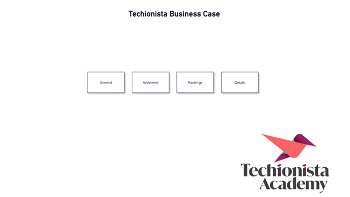
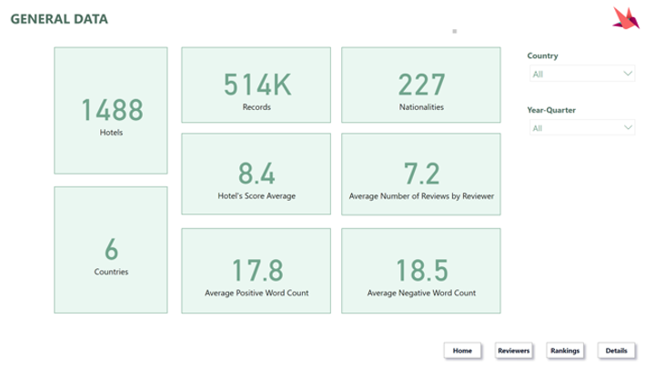
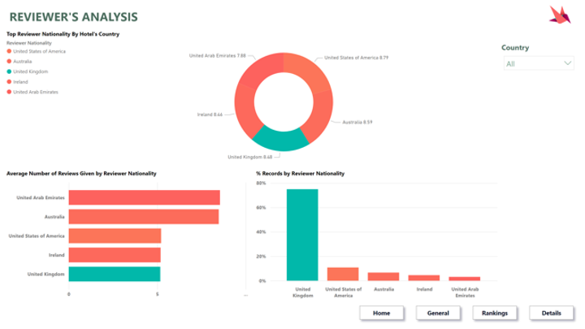

## README

Welcome to one of my projects towards Training Data Analyst/Data Engineer at the Techionista Academy in Amsterdam, The Netherlands.

You can check the link to the repository. Below, you can find snippets of my journey.

# Table of Contents
1. [Overview](#Overview)
2. [Data Overview](#Data-Overview)
3. [Questions from the dataset](#Questions-from-the-dataset)
4. [Steps](#Steps)
5. [Aesthetics](#Aesthetics)
6. [Data Visualization](#Data-Visualization)
7. [Publishing report on PowerBI service](#Publishing-report-on-PowerBI-service)
8. [Final thoughts](#Final-thoughts)

# Project Overview

These are the main goals for this project:
Analyze a large dataset that contains hotel’s data from different countries in Europe with **Power BI**.
Take all the feedback from the traveler’s reviews and extract interesting information about their experience.
Provide insights that improve the hotel’s performance.
Create a report page or/and dashboard in Power BI to present results.

# Data Overview

The holiday dataset contains more than **500K** rows in **17 columns** for luxury hotels across Europe. 
Data is saved in **csv** format.

The dataset is hosted in **Azure Blob Storage**. Thus, we get data in Power BI using the Azure Blob gateway.

# Questions from the dataset

Using Power BI we need to answer questions that help us create beautiful reports and dashboards:

1. What can we do with the dataset?
1. Which is the best way to present complex data?
1. How to Power Bi helps us to clean and manipulate data in an interactive way?

# Steps

Prior to creating insightful reports in Power BI is important to prepare our data through the following steps.

**Exploratory data analysis for the hotel’s dataset**

As previously exposed our dataset contains many rows and columns. We need to know if all the columns are helpful for getting insights or if it is possible to transform data from the columns to adjust report requirements.

1. Change the data type in specific columns from text to whole number and so on.
1. Delete trailing spaces and standardize names.
1. Standardize column names.
1. Fix errors in the dataset. We use data profile tools and filters in Power Query to detect that and fix it.
1. Check duplicates. We need to be careful with duplicates.
1. Check data inconsistency and work on null values. In some cases they are helpful so we do not delete them.
1. Transform one column into two or more columns. For instance Hotel_Adress column contains the entire address of the hotel including city and country. We split that column and we create additional features like City and Country.
1. The column tags describe properties about travel type, group type, or room type in one row. In order to improve readability and clarity we use tools from Power BI (split columns, replace or conditional columns) to clean up the column tags and create new features.
1. We use **Python** in Power BI for clean Positive_Review and Negative_Review. Those columns contain reviews from hotel customers. Which is also useful information but before building a bag of words it is better to clean text from buzzwords and non-characters.

After cleaning data it is time to create reports in Power BI.

# Aesthetics

One of the principles from Power BI is to be clear and concise. Do not put a lot of information in one page.

Because there are many interesting topics to be covered in this Business Case it is better to separate insights in different report's pages. Always looking to tell a story.

Color palette is also relevant in this business case. Therefore it is important to respect the institutional colors to adjust the report for the company design guidelines.

# Data visualization

### 1.Home
A main page with a simple navigation menu.

### 2.General data
A panel that contains relevant information from the dataset. A first approach to our data.

### 3.Reviewers
A detailed analysis from the reviewer's information. With this report we cover a couple of relevant questions:
1. For every hotel's country. What is the most repeated reviewer nationality?
1. What’s the average score depending on its nationality?
1. All the data can be filtered by the hotel's country.

### 4.Rankings
Top and bottom hotels filtered by country, year and top/bottom 5, 10 or 15 values.

### 5.Details 
Total reviews, total negative and positive reviews. Filtered by hotel, country and specific dates.

# Publishing report on PowerBI service

The last step is publishing the report in Power Bi service. Do you have a power bi account? Take a look to this link [Holidays Project](https://app.powerbi.com/groups/me/reports/7a938456-ae3e-4bf4-8acc-cdf93ba9fc54/ReportSection63cd2ef08c7d3a817ce7?ctid=23828106-3f61-47d7-9e8d-c03d006b795f&experience=power-bi).

# Final thoughts

As you can see with Power Bi there is a big world of possibilities.
There are plenty of interesting tools for cleaning and manipulating data in one platform.
Power BI works fine with excel, csv files, JSON, SQL scripts.
Personally I am glad to start my journey with Power BI and I feel more and more confident using the platform.

